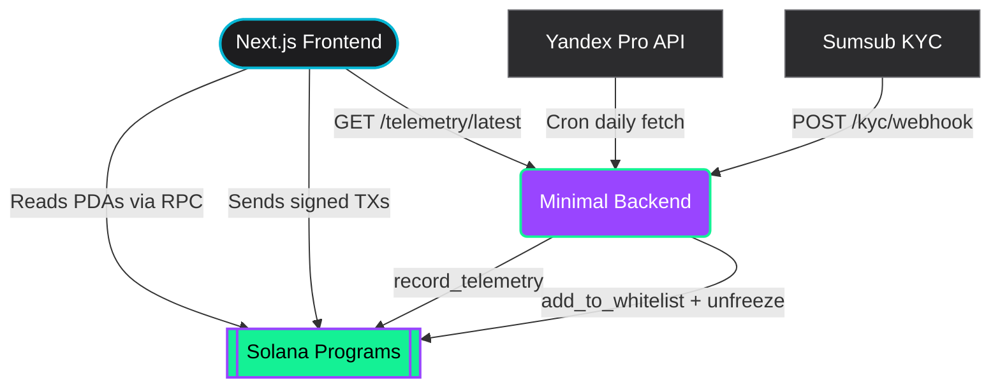

<div align="center">
  

  <br/>
  <br/>

  <h1>🚕 AXEL — RWA Taxi Tokenization on Solana</h1>

  <p><strong>Fully on-chain Real-World Asset platform for tokenizing taxi vehicles<br/>and distributing passive income to fractional owners.</strong></p>

  <br/>

  <!-- Shields / Badges -->
  <p>
    <a href="https://solana.com"></a>
    <a href="https://spl.solana.com/token-2022"></a>
    <a href="https://nextjs.org/"></a>
    <a href="https://www.typescriptlang.org/"></a>
    <a href="https://tailwindcss.com/"></a>
    <a href="https://docs.sumsub.com/"></a>
  </p>

  <p>
    
    
    
    
  </p>
</div>

---

## 📋 Table of Contents

- [Overview](#-overview)
- [Key Features](#-key-features)
- [Architecture](#-architecture)
- [Token-2022 Extensions](#-token-2022-extensions)
- [On-Chain Entities (PDAs)](#-on-chain-entities-pdas)
- [Tech Stack](#-tech-stack)
- [Project Structure](#-project-structure)
- [Getting Started](#-getting-started)
- [Environment Variables](#-environment-variables)
- [Available Scripts](#-available-scripts)
- [Design System](#-design-system)
- [Internationalization (i18n)](#-internationalization-i18n)
- [Security](#-security)
- [Roadmap](#-roadmap)
- [Team](#-team)
- [Contributing](#-contributing)
- [License](#-license)

---

## 📖 Overview

**AXEL** is a cutting-edge platform that democratizes investments in real-world assets on the Solana blockchain. Our MVP focuses on the tokenization of a **single physical taxi vehicle** — by purchasing tokens, investors become fractional owners of the asset and receive a proportional share of income generated from its daily operation via Yandex Pro.

<br/>

> [!IMPORTANT]
> **The Golden Architecture Rule:**
> _State is exclusively on-chain._ The frontend reads data directly from Solana RPCs, while a minimal Node.js backend handles only non-browser compatible operations: KYC webhooks and Oracle data signing.
> **No database. No server state. The blockchain is the single source of truth.**

<br/>

<div align="center">
  
  <br/>
  <em>Premium fintech dashboard: token tracking, live telemetry, and direct SOL claiming.</em>
</div>

---

## ✨ Key Features

| Feature | Description |
| :--- | :--- |
| 💸 **Token-2022 Compliance** | Uses modern Solana Token Extensions (Transfer Hooks, Freeze Authority, Permanent Delegate, Metadata) for protocol-level compliance without breaking composability |
| 🔒 **On-Chain Whitelist** | Transfer Hooks prevent non-KYC'd wallets from interacting with tokens — enforced at the protocol level |
| 🚖 **Live Telemetry Oracle** | Real daily revenue and mileage from Yandex Pro API, pushed to Solana via a signed oracle with SHA-256 proof |
| 📊 **On-Chain Dividends** | Transparent `Profit = Revenue − Expenses − Reserve` calculation. Investors claim SOL directly on-chain per period |
| 🚫 **Zero Database** | Frontend reads directly from Program Derived Addresses (PDAs) — no traditional backend state |
| 🌍 **Multilingual** | Full i18n support: Russian 🇷🇺, English 🇬🇧, Kazakh 🇰🇿 via `next-intl` |
| 🎨 **Apple-Inspired Design** | Minimalist design system inspired by Apple HIG — Inter font, 8px grid, single Cyan accent |
| ⚡ **Security First** | CSP headers, multisig authorities, oracle key isolation, wallet-based identity (SIWS) |

---

## 🏗 Architecture

AXEL relies on **minimal centralization**, shifting business logic natively to Solana Smart Contracts. The backend exists only as a secure proxy for two external systems.



### What the Backend Does (and Nothing More)

| ✅ Backend Handles | ❌ Backend Does NOT Handle |
| :--- | :--- |
| Yandex Pro API cron + oracle signing | User data / investment records |
| KYC webhook receiver (1 endpoint) | Investment validation (on-chain) |
| Telemetry read endpoint (1 endpoint) | Payout tracking (on-chain PDAs) |
| | Auth / sessions / JWT |
| | Reporting / analytics |

> **Total backend endpoints: 3** — `GET /health`, `GET /telemetry/latest/:project_id`, `POST /kyc/webhook`

---

## 🪙 Token-2022 Extensions

All extensions are configured **at mint initialization** — once created, they are immutable.

| Extension | Level | Purpose in AXEL |
| :--- | :---: | :--- |
| **Transfer Hook** | Mint | Every token transfer triggers whitelist verification for both sender and receiver. Non-KYC wallets are rejected at the protocol level |
| **Default Account State (Frozen)** | Mint | Newly created token accounts start frozen. Unfreezing requires KYC approval via Freeze Authority |
| **Permanent Delegate** | Mint | Enables regulatory clawbacks and refunds when hardcaps/softcaps are breached |
| **Transfer Fee** | Mint | 1% secondary market fee auto-routed to a reserve fund |
| **Metadata Pointer** | Mint | Points to the mint itself for on-chain metadata storage |
| **Token Metadata** | Mint | Stores car VIN, make, model, year, and valuation directly on-chain |
| **Memo Transfer** | Account | All transfers include a memo — creating an on-chain audit trail |

---

## 📦 On-Chain Entities (PDAs)

All program state lives in Program Derived Addresses, readable by anyone:

```
ProjectState (PDA: ["project", asset_id])
  ├── admin, mint, escrow_vault, revenue_vault
  ├── token_supply, price_per_share
  ├── min_raise, max_raise, sol_raised
  ├── deadline (Unix timestamp)
  └── status: Fundraising | Finalized | Active | Paused | Closed

InvestorRecord (PDA: ["investor", project, wallet])
  ├── sol_invested
  └── tokens_received

RevenuePeriod (PDA: ["revenue", project, period_index])
  ├── total_deposited, token_supply_snapshot
  └── deposited_at

ClaimRecord (PDA: ["claim", revenue_period, wallet])
  └── claimed: bool  (prevents double-claim)

WhitelistEntry (PDA: ["whitelist", wallet])
  └── approved: bool  (read by Transfer Hook on every transfer)

TelemetryRecord (PDA: ["telemetry", project, date_unix_day])
  ├── data_hash: SHA-256 of Yandex Pro payload
  ├── oracle_pubkey
  └── recorded_at
```

### On-Chain Instructions

```
initialize_project    start_raise        invest
finalize_raise        refund             deposit_revenue
claim_revenue         pause_project      resume_project
close_project         add_to_whitelist   remove_from_whitelist
record_telemetry      update_oracle
```

---

## 🛠 Tech Stack

### Frontend

| Technology | Version | Purpose |
| :--- | :---: | :--- |
| **Next.js** | 14.x | React framework with App Router, SSR, and API routes |
| **TypeScript** | 5.x | Type safety across the entire codebase |
| **Tailwind CSS** | 3.x | Utility-first CSS with custom AXEL design tokens |
| **@solana/web3.js** | 1.98.x | Direct Solana RPC reads and transaction construction |
| **@solana/wallet-adapter** | latest | Phantom & Backpack wallet integration |
| **next-intl** | 4.x | Full i18n support (RU/EN/KK) |
| **Lucide React** | 1.x | Minimalist icon set (outlined, 1.5px stroke) |
| **React Hook Form + Zod** | latest | Type-safe forms with schema validation |
| **Vitest** | 3.x | Unit and component testing (80% coverage threshold) |

### Backend (Minimal)

| Technology | Purpose |
| :--- | :--- |
| **NestJS** | Oracle cron + KYC webhook (no DB, no ORM) |
| **@solana/web3.js** | On-chain instruction calls |
| **Pino** | Structured logging with correlation IDs |
| **Sentry** | Error tracking and alerting |

### On-Chain

| Technology | Purpose |
| :--- | :--- |
| **Anchor (Rust)** | Solana program framework |
| **Token-2022** | Token Extensions for RWA compliance |
| **Squads Multisig** | Multi-signature authority management |

---

## 📂 Project Structure

```
axel-sol/
├── docs/
│   ├── assets/                     # Hero banner, dashboard mockup
│   ├── development_plan.md         # Full team development plan
│   ├── plan_frontend.md            # Frontend-specific user stories
│   ├── plan_backend.md             # Backend-specific user stories
│   ├── plan_onchain.md             # On-chain developer plan
│   └── rwa_taxi_tokenization_spec.md  # Technical specification (RU)
│
├── frontend/
│   ├── src/
│   │   ├── app/
│   │   │   └── [locale]/           # i18n routing (ru/en/kk)
│   │   │       ├── page.tsx        # Car catalog (home page)
│   │   │       ├── assets/         # Asset detail page
│   │   │       ├── dashboard/      # Investor dashboard
│   │   │       ├── payouts/        # Payout history
│   │   │       └── admin/          # Admin panel
│   │   │
│   │   ├── components/
│   │   │   ├── admin/              # Revenue deposit, project controls
│   │   │   ├── asset/              # Asset detail cards
│   │   │   ├── catalog/            # Asset cards, catalog grid
│   │   │   ├── dashboard/          # Portfolio, telemetry widget
│   │   │   ├── invest/             # Investment flow forms
│   │   │   ├── kyc/                # KYC status components
│   │   │   ├── layout/             # Navbar, Footer, constants
│   │   │   ├── payouts/            # Payout history table
│   │   │   ├── shared/             # RpcErrorBoundary, common
│   │   │   ├── ui/                 # Design system primitives
│   │   │   └── wallet/             # Wallet connection UI
│   │   │
│   │   ├── hooks/                  # Custom React hooks
│   │   │   ├── useInvest.tsx       # Investment transaction
│   │   │   ├── useClaim.ts         # Revenue claim transaction
│   │   │   ├── useDashboard.ts     # Dashboard data aggregation
│   │   │   ├── useProjectState.ts  # On-chain project reads
│   │   │   ├── useTelemetry.ts     # Backend telemetry API
│   │   │   ├── useWhitelistStatus.ts  # KYC/whitelist check
│   │   │   └── useAdminAccess.ts   # Admin wallet verification
│   │   │
│   │   ├── lib/
│   │   │   ├── solana/             # RPC helpers
│   │   │   │   ├── connection.ts   # RPC connection with retry
│   │   │   │   ├── pda.ts          # PDA derivation helpers
│   │   │   │   ├── readers.ts      # On-chain data deserialization
│   │   │   │   ├── instructions.ts # TX construction
│   │   │   │   └── errors.ts       # Error code mapping
│   │   │   ├── api/                # Telemetry API client
│   │   │   └── security/           # Input sanitization
│   │   │
│   │   ├── providers/              # WalletProvider (Phantom/Backpack)
│   │   ├── types/                  # TypeScript interfaces
│   │   ├── styles/                 # Global CSS
│   │   └── i18n/                   # i18n routing config
│   │
│   ├── messages/                   # Translation files
│   │   ├── ru.json                 # 🇷🇺 Russian
│   │   ├── en.json                 # 🇬🇧 English
│   │   └── kk.json                 # 🇰🇿 Kazakh
│   │
│   ├── DESIGN_SYSTEM.md            # Apple-inspired design system docs
│   ├── design-tokens.json          # Design tokens (colors, spacing, type)
│   ├── tailwind.config.ts          # Tailwind with AXEL design tokens
│   ├── vitest.config.ts            # Test config (80% coverage)
│   └── package.json
│
└── README.md
```

---

## 🚀 Getting Started

### Prerequisites

- **Node.js** ≥ 18.x
- **npm** ≥ 9.x
- A Solana wallet browser extension ([Phantom](https://phantom.app/) or [Backpack](https://www.backpack.app/))

### Installation

```bash
# 1. Clone the repository
git clone https://github.com/your-org/axel-sol.git
cd axel-sol

# 2. Install frontend dependencies
cd frontend
npm install

# 3. Configure environment
cp .env.local.example .env.local
# Edit .env.local with your Solana RPC URL and Program ID

# 4. Start development server
npm run dev
```

The app will be available at **http://localhost:3000**.

---

## 🔑 Environment Variables

Create `frontend/.env.local` from the example file:

| Variable | Description | Default |
| :--- | :--- | :--- |
| `NEXT_PUBLIC_SOLANA_RPC_URL` | Solana RPC endpoint (Helius / QuickNode / public) | `https://api.devnet.solana.com` |
| `NEXT_PUBLIC_SOLANA_NETWORK` | Network: `devnet` \| `mainnet-beta` | `devnet` |
| `NEXT_PUBLIC_PROGRAM_ID` | Deployed `rwa-taxi` program ID | — |
| `NEXT_PUBLIC_TELEMETRY_API_URL` | Minimal backend URL | `http://localhost:3001` |
| `NEXT_PUBLIC_KYC_URL` | Sumsub KYC form URL | — |

---

## 📜 Available Scripts

Run from the `frontend/` directory:

| Command | Description |
| :--- | :--- |
| `npm run dev` | Start Next.js development server |
| `npm run build` | Build production bundle |
| `npm run start` | Start production server |
| `npm run lint` | Run ESLint |
| `npm run format` | Format code with Prettier |
| `npm run test` | Run tests with Vitest |
| `npm run test:cov` | Run tests with coverage report (80% threshold) |

---

## 🎨 Design System

AXEL uses a **minimalist Apple-inspired design system** — typography and spacing are the primary design tools.

> _"If an element doesn't help the user make a decision — remove it."_

### Design Principles

| # | Principle | In Practice |
| :---: | :--- | :--- |
| 1 | **Content-first** | Typography = 80% of design. Color = accent, not decoration |
| 2 | **Breathing room** | Generous whitespace. Sections breathe. Nothing cramped |
| 3 | **One color, one purpose** | Cyan `#06B6D4` = "take action". Everything else is grayscale |
| 4 | **Quiet confidence** | No animations for animations' sake. Smoothness = respect |
| 5 | **Reduce, then reduce again** | No borders where shadows work. No gradients. No glow |

### Color Palette

```
Brand Cyan          #06B6D4  ██  Primary CTA, links, active states
                    #0891B2  ██  Hover
                    #0E7490  ██  Active / pressed

Apple System Colors
  Success           #34C759  ██  Active, confirmed, profit
  Warning           #FF9F0A  ██  Fundraising, pending
  Error             #FF3B30  ██  Failed TX, errors
  Info              #007AFF  ██  Informational tooltips

Neutrals (Light)
  Background        #FFFFFF  ██
  Secondary bg      #F5F5F7  ██  Apple's signature gray
  Text primary      #1D1D1F  ██  Apple's near-black
  Text secondary    #6E6E73  ██
```

### Typography

- **Primary:** `Inter` (closest free analog to SF Pro)
- **Monospace:** `JetBrains Mono` (wallet addresses, SOL amounts)
- **Body size:** `17px` (Apple's standard, prevents iOS zoom)
- **Scale:** Display (56px) → Caption (11px), following Apple HIG

### Benchmarks

Apple.com · Linear.app · Stripe.com

> 📄 Full design system documentation: [`frontend/DESIGN_SYSTEM.md`](frontend/DESIGN_SYSTEM.md)
> 📐 Design tokens: [`frontend/design-tokens.json`](frontend/design-tokens.json)

---

## 🌍 Internationalization (i18n)

Full multilingual support via [`next-intl`](https://next-intl-docs.vercel.app/):

| Language | File | Status |
| :---: | :--- | :---: |
| 🇷🇺 Russian | `messages/ru.json` | ✅ Complete |
| 🇬🇧 English | `messages/en.json` | ✅ Complete |
| 🇰🇿 Kazakh | `messages/kk.json` | ✅ Complete |

Routes are locale-prefixed: `/ru/dashboard`, `/en/admin`, `/kk/payouts`.

---

## 🔒 Security

| Layer | Measure |
| :--- | :--- |
| **On-Chain** | Transfer Hooks enforce whitelist on every token transfer |
| **On-Chain** | Default Account State (Frozen) — tokens locked until KYC |
| **On-Chain** | Permanent Delegate — regulatory clawback capability |
| **On-Chain** | Multisig (Squads) for all privileged authorities |
| **Backend** | Oracle keypair isolated in Secrets Manager |
| **Backend** | Sumsub webhook signature verification |
| **Backend** | Startup fails fast if secrets missing |
| **Frontend** | Content-Security-Policy headers configured |
| **Frontend** | X-Frame-Options: DENY, X-Content-Type-Options: nosniff |
| **Frontend** | Wallet address validation before all on-chain calls |
| **Frontend** | No inline scripts, strict Referrer-Policy |
| **Auth** | Sign-In with Solana (SIWS) — no JWT, no server sessions |

---

## 🗺 Roadmap

| Phase | Timeline | Milestone |
| :---: | :--- | :--- |
| ✅ **1** | Days 1–5 | Foundation — project scaffolding, wallet adapter, RPC helpers |
| 🔄 **2** | Days 6–12 | Core — catalog, asset pages, on-chain instructions, oracle cron |
| ⬜ **3** | Days 13–18 | Integration — full invest flow, dashboard, telemetry widget |
| ⬜ **4** | Days 19–23 | Polish — admin panel, payout history, mobile responsive |
| ⬜ **5** | Days 24–29 | Security — CSP hardening, E2E QA, security audit |
| ⬜ **6** | Days 30–34 | Launch — staging deploy, smoke tests, mainnet readiness |

---

## 👥 Team

| Role | Handle | Responsibility |
| :--- | :--- | :--- |
| **Frontend** | `dimagonedone` | Next.js, Wallet Adapter, direct RPC reads, design system |
| **On-Chain** | `ndrkbrg` | Anchor/Rust, Token-2022, Transfer Hook, deployment |
| **Backend** | `russh` | NestJS minimal — oracle cron + KYC webhook only |

---

## 🤝 Contributing

We welcome contributions from the community! Here's how you can help:

1. **Fork** the repository
2. **Create** a feature branch: `git checkout -b feature/awesome-feature`
3. **Commit** your changes: `git commit -m 'feat: add awesome feature'`
4. **Push** to the branch: `git push origin feature/awesome-feature`
5. **Open** a Pull Request

Please read our documentation in `docs/` before contributing to understand the architecture and conventions.

---

## 📄 License

This project is licensed under the **MIT License** — see the [LICENSE](LICENSE) file for details.

---

<div align="center">
  <br/>
  
  <br/>
  <br/>
  <strong>Make real-world assets liquid, transparent, and accessible.</strong>
  <br/>
  <sub>Built with ❤️ for the future of RWA on Solana.</sub>
  <br/>
  <br/>
</div>
