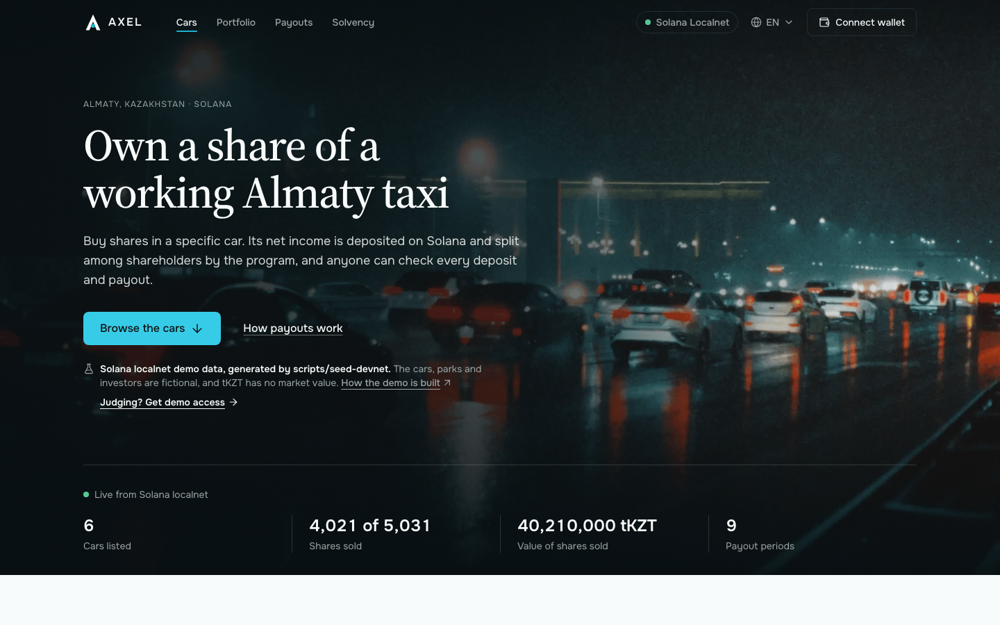
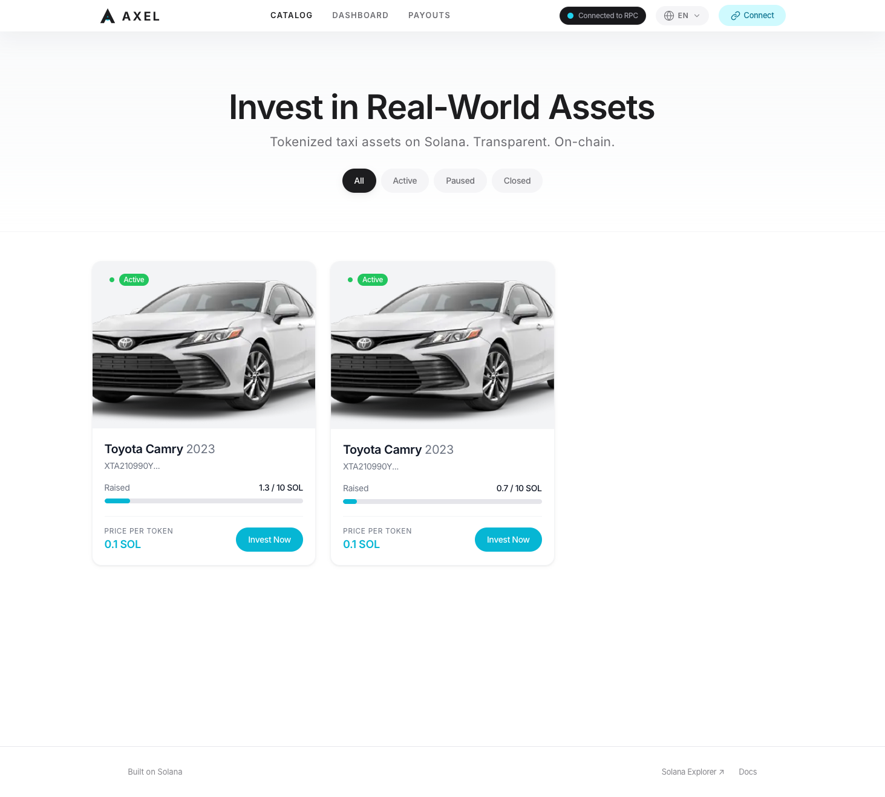
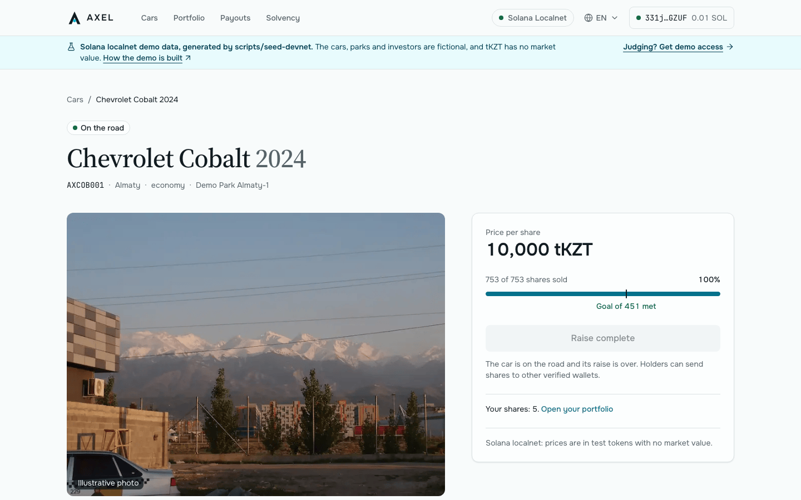
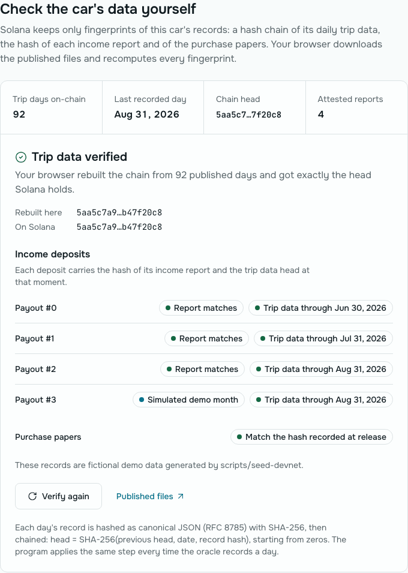
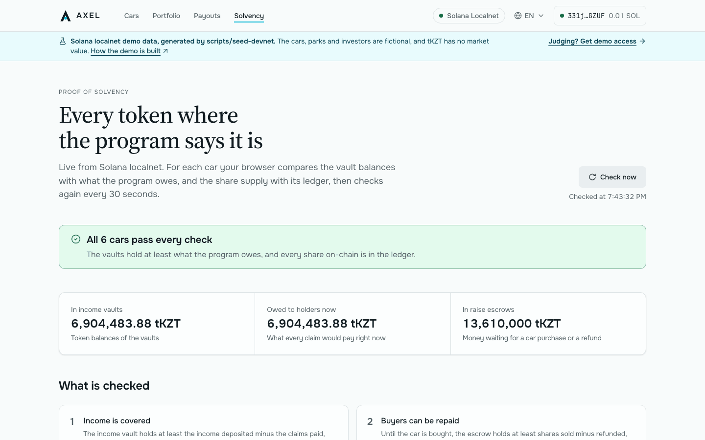
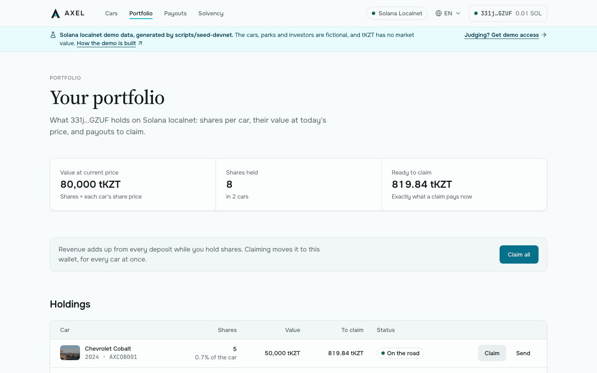
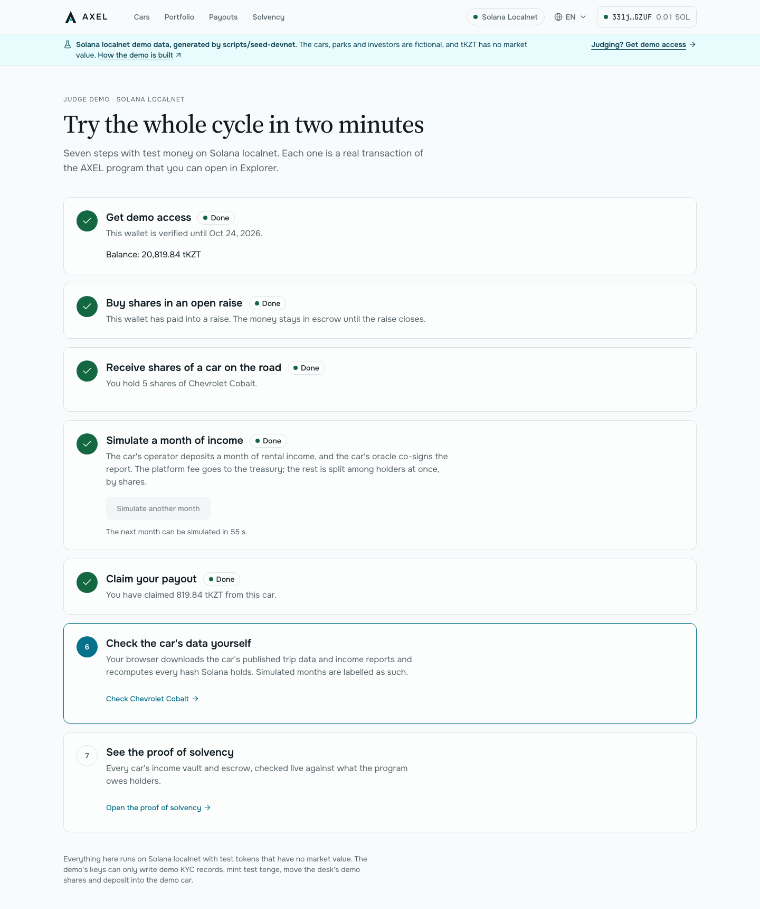

# AXEL — Tokenized Taxi Cars on Solana

[](https://github.com/dmitriytsoy22/axel-sol/actions/workflows/ci.yml)
[](LICENSE)
[](#deployment-status)
[](https://colosseum.com/arena/projects/axel-1)

> Fractional ownership of working taxi cars in Kazakhstan. Investors fund one specific car in a stablecoin through an escrowed raise and hold its shares as a Token-2022 token that only KYC-verified wallets can hold. The car's income is paid out pro rata by an Anchor program, and each deposit is attested against a public hash chain of the car's daily trip data.

[Docs](docs/) · [Architecture](docs/architecture.md) · [v2 program design](docs/v2.md) · [Judge demo path](#judge-demo-path) · [Security](#security) · [Colosseum Project](https://colosseum.com/arena/projects/axel-1)

---



---

## Built for Colosseum Crypto World's Fair 2026

| Name | Role | GitHub | Based in |
|------|------|--------|----------|
| Dmitriy Tsoy | Founder, frontend & product | [@dmitriytsoy22](https://github.com/dmitriytsoy22) | Almaty, Kazakhstan |

AXEL existed before the hackathon. See [Prior Work and Hackathon Scope](#prior-work-and-hackathon-scope) for what was built when and by whom.

---

## Problem and Solution

### 1. Access to cash-flowing assets
- **Problem:** A taxi earns money every day, but earning from one means buying and running the whole car. There is no simple way to hold a small, transferable share of one specific vehicle, and no safe way to pool money for a car that has not been bought yet.
- **AXEL:**
  - `create_project` opens a raise for one car. The raise has a Token-2022 share mint with 0 decimals (one token is one share), a fixed price in a stablecoin, a soft cap and a deadline.
  - `buy_shares` puts the buyer's payment into the project's escrow vault, a token account only the program controls, and mints the shares.
  - `activate_project` pays the escrow to the fleet operator, minus the platform's raise fee. It needs the hash of the car's purchase documents and must happen before the activation deadline.
  - If the soft cap is missed, the raise is cancelled or activation comes too late, every buyer gets exactly what they paid back with `refund`.

### 2. Trust in reported income
- **Problem:** Co-investors in a car usually see only the income the owner chooses to report.
- **AXEL:**
  - **Daily data.** The backend, as the project's oracle, publishes each day of the car as RFC 8785 JSON: trips, kilometres, the rent the park charged, and whether the data is real or simulated. It appends each day's SHA-256 to a hash chain kept in the project account (`record_telemetry`).
  - **Attested deposits.** A revenue deposit needs two signatures: the operator's, who pays, and the oracle's. The backend co-signs only when the amount equals a report rebuilt from the published days, minus the park's fee, maintenance and insurance. The report's hash and the chain head are stored with the deposit.
  - **Checks anyone can run.** On the car page, "Check the car's data yourself" downloads the published files and recomputes every hash in the browser. The Proof of solvency page checks every vault against what the program owes.
- **Gaps:**
  - The chain proves that published data was not changed afterwards, not that the fleet system reported the truth.
  - The oracle is one backend key.
  - The Yandex Fleet requests have not been run against a real park.

### 3. Compliance and KYC on every transfer
- **Problem:** A plain SPL token can be sent to anyone. Shares of a real asset need an allow-list of holders, enforced on every transfer and not only at the first sale.
- **AXEL:**
  - **KYC records.** Each wallet has an `Investor` record with status, expiry, jurisdiction and provider. Only the KYC key can write it. A devnet demo key can write DEMO records only, for at most 30 days.
  - **The hook.** The share mint's transfer hook is `axel_v2` itself. Token-2022 calls it on every transfer, and it rejects the transfer unless both owners hold an eligible record and the car is on the road.
  - **Frozen by default.** Share accounts start frozen. The program thaws only an owner's canonical account, and only together with that owner's ledger position.
  - **Sumsub.** The backend binds a wallet with Sign-In With Solana, sends it through Sumsub, and its webhook writes the record with a dedicated KYC key.
- **Gap:** the web app has no Sumsub flow yet. Records are written from the console's KYC tab or, for judges, by the demo route.

### 4. Fair payouts
- **Problem:** Splitting revenue among many small holders off-chain means trusting whoever does the math and sends the money.
- **AXEL:**
  - **Accumulator.** Revenue per share is an accumulator. Each deposit raises it, and each position keeps a checkpoint.
  - **Transfers keep income with its earner.** The hook settles both sides on every transfer. Income earned before a transfer stays with the sender, and a buyer earns only from the moment they hold.
  - **Claims.** A claim pays everything accrued, into the owner's own token account, whenever the owner likes after activation, including while the car is paused or after it is sold.
  - **No overpayment.** Rounding always favours the vault. A property test and the invariant checks after every randomized step show that payouts never exceed net deposits.

Open issues are listed under [Security](#security) and in [docs/architecture.md](docs/architecture.md#known-limitations).

---

## Why Solana

- **Token-2022 instead of a custom token program.**
  - Each share mint uses TransferHook, DefaultAccountState (Frozen), PermanentDelegate, MetadataPointer and TokenMetadata.
  - The car's make, model, year, city, class and park are in the mint's metadata, so wallets and explorers show them.
  - Every authority is the project PDA or none, so no human key can mint, freeze, move shares or re-point the hook.
- **A hook that is also the ledger.** Token-2022 calls `axel_v2` on every `transfer_checked`, whichever wallet or program moves the shares. That one call checks KYC on both sides and moves the revenue entitlement with the shares, in about 40–66k compute units.
- **Stablecoins with checked extensions.**
  - Prices and payouts are in an allowlisted stablecoin: tKZT test tenge on devnet, and a tenge stablecoin or USDC on mainnet.
  - A Token-2022 payment mint is accepted only if every extension it has is on the program's allowlist.
  - The purchase dialog discloses any power the issuer has to freeze or seize funds.
- **Cheap enough for daily data.** 20 days of telemetry fit in one transaction of about 29k compute units. A claim collects every deposit since the last one, and "Claim all" pays out up to four cars in one transaction.
- **Solana Actions.** The invest and claim Blinks let anyone buy into a raise or claim a payout from a post on X or Telegram.

---

## Summary of Features

**Investor** (web app on `axel_v2`)
- **Landing page and catalog.** Live figures from the chain: cars listed, shares sold, value sold per payment token and payouts. Each car comes from its share mint's metadata, with filters by state, city and class.
- **Car page:**
  - state, price in the payment token, and raise progress with a soft-cap marker and a countdown;
  - the escrow balance read live, a timeline of the project's states, fees, holders, and Explorer links for every account;
  - the buy dialog explains the escrow, the refund rule and any power the stablecoin's issuer holds;
  - the buy button reads the wallet's KYC record and says why it is disabled;
  - anyone can settle a raise whose outcome is certain, and the refund dialog settles a failed raise first when nobody has.
- **"Check the car's data yourself."** The browser downloads the car's published telemetry, income reports and purchase papers, hashes them with WebCrypto over RFC 8785 JSON, rebuilds the telemetry hash chain and compares every fingerprint with the chain.
- **Proof of solvency.** For every car, live: the income vault against deposited − claimed and what holders are owed now, the escrow against sold × price, the share supply against the ledger, and the revenue checkpoints.
- **Portfolio:**
  - an alert with a veto button when a recovery of the wallet's shares is pending;
  - value, shares, and exactly what a claim pays now, computed with the program's own math on BigInt;
  - claims per car or "Claim all", and refunds;
  - sending shares to another verified wallet. The recipient's KYC is checked while the address is typed, and a first-time recipient is onboarded in the same transaction.
- **Payout history.** From the chain, or the wallet's own part of each deposit from an indexer.
- **Feedback and languages.** Every transaction outcome appears in a toast with an Explorer link, and every program error is explained in English, Russian and Kazakh.

**Judge demo** (devnet and localnet deployments only)
- **`/demo`**, seven steps with a wallet and nothing else:
  1. sign a message to get a demo KYC record, 50,000 test tenge and 0.01 SOL;
  2. buy in an open raise;
  3. receive shares of an operating car from the desk;
  4. simulate a month of income, which the operator deposits and the car's oracle co-signs;
  5. claim;
  6. verify the car's data;
  7. open the proof of solvency.

  It is rate-limited per wallet, per IP address and in total with Upstash Redis, and Cloudflare Turnstile is optional.
- **Solana Actions (Blinks)** to invest in a car's open raise or claim its payout. `actions.json` makes a car page unfurl into its invest Blink.

**Console** (`/admin`, roles read from the chain)
- **Platform admin:**
  - every car's state: settle, release to the operator with the purchase documents' hash, cancel, pause, resume, close;
  - the car's operator and oracle;
  - share recovery: propose, run, withdraw;
  - the config account.
- **Operator:** its cars' deposits, keys, live income vault and payout history.
- **KYC key and devnet demo KYC key:** look a wallet's record up, then approve or revoke it.

**Program** (`axel_v2`, 24 instructions, 23 events; [docs/v2.md](docs/v2.md))
- **Raise:** escrowed, with a soft cap, a deadline, an activation window and exact refunds.
- **KYC registry:** written only by the KYC key; the demo KYC key can grant DEMO access and nothing else.
- **Transfer hook:** checks both owners and keeps a ledger in which every holder's balance equals its position.
- **Revenue:** deposits co-signed by the oracle and paid out through an accumulator, plus a `Final` deposit for the car's sale.
- **Telemetry:** a hash chain of the car's days.
- **Recovery:** time-locked and vetoable by the owner, for lost keys and inheritance.
- **Pause:** a protocol pause that never blocks claims, refunds or a veto.
- **Hard caps** on fees (5% of a raise, 20% of revenue) and on how long money can sit in escrow (180-day raise, 90-day activation window).

**Backend** (NestJS 11, SQLite; [docs/api.md](docs/api.md#backend-http-endpoints))
- **Oracle for several cars:**
  - it collects each day from Yandex Fleet or a deterministic simulator. Simulated days are marked `data_origin: "simulated"` inside the hashed text and are refused on mainnet;
  - it publishes each day and appends it to the chain, 20 days per transaction, and reconciles a crash between sending and confirming on the next run.
- **Revenue reports:** rent − park fee − maintenance − insurance (plus the sale proceeds in a final report). The operator sends its monthly report and gets back a `deposit_revenue` the oracle already co-signed, for its wallet to sign; or it signs one itself and sends it for attestation. The oracle signs only a deposit that matches the report rebuilt from the published days and overlaps no earlier deposit.
- **Published car data:** each car's confirmed days and attested reports, in the layout the app's "Check the car's data yourself" reads. Every telemetry and report response says whether the figures are real or simulated.
- **KYC:** Sign-In With Solana with a single-use nonce, then a Sumsub applicant bound to the wallet. The webhook checks the HMAC over the raw body in constant time, confirms approvals with the Sumsub API, and writes `set_investor` with a dedicated key. It never sends a transaction that would change nothing.
- **Event indexer:** the program's history plus a live `logsSubscribe` feed, stored idempotently in SQLite. It keeps the events the transfer hook emits inside Token-2022, and serves `/events`, project histories, claim totals and each wallet's payouts. What a wallet can claim is replayed from the events with the program's own math, to the base unit.
- **Fails closed:** it refuses to start in production without its secrets and keys, CORS allows only the configured origins, and the sign-in endpoints are rate-limited.

**Demo seed** ([scripts/seed-devnet](scripts/seed-devnet/README.md))
- From one secret it plans and runs a fictional fleet in every project state:
  - months of telemetry, attested deposits, claims and transfers;
  - a car sale, a pause, and a failed raise with refunds;
  - a share recovery.
- The executor is idempotent and resumable. The dry run prices the SOL budget with live rent, and the proof-of-solvency check (I1–I5) covers every project.

**Quality**

| Suite | Tests |
|---|---|
| `axel_v2` on LiteSVM | 530 |
| `axel_v2` Rust unit and property tests | 35 |
| Generated SDK against the IDL | 73 |
| Frontend unit tests (Vitest) | 522 |
| Backend (Jest) | 397, plus the indexer and the operator's deposit flow against a real `solana-test-validator` |
| Demo seed | 90 |
| Playwright end to end | the judge path and the KYC refusal, run against the real app, backend and program on a freshly seeded local validator |

**v1 (legacy).** The original `axel` and `transfer_hook` programs, deployed on devnet before the hackathon. The app no longer uses them ([Deployment Status](#deployment-status)).

---

## Tech Stack

| Layer | Technology |
|-------|-----------|
| On-chain program | Rust 1.89.0 · Anchor 0.32.1 (`anchor-lang`, `anchor-spl`) · `spl-token-2022` 8 · `spl-transfer-hook-interface` 0.10 · `spl-tlv-account-resolution` 0.10 |
| Token standard | SPL Token-2022 share mints (TransferHook, DefaultAccountState, PermanentDelegate, MetadataPointer, TokenMetadata); payments in SPL Token or vetted Token-2022 stablecoins |
| Program tests | LiteSVM 0.8 with `node:test` (530) · `cargo test` with proptest (35) · v1: `node:test` against a local validator (49) |
| Client SDK | Codama → `sdk/axel-v2` (`@solana/kit` 6), checked against the IDL |
| Frontend | Next.js 14.2 · React 18.3 · TypeScript 5 · Tailwind CSS 3.4 · `@coral-xyz/anchor` 0.32.1 · `@solana/web3.js` 1.98 · `@solana/spl-token` 0.4 · Solana Wallet Adapter · `next-intl` 4.8 · React Hook Form 7 + Zod 3 · Solana Actions |
| Frontend tests | Vitest 3.2 · Testing Library · jsdom · Playwright 1.63 |
| Backend | NestJS 11 · `@nestjs/schedule` 5 · `@nestjs/throttler` 6 · `better-sqlite3` 12 · `@solana/web3.js` 1.98 · `@coral-xyz/anchor` 0.32.1 · `ws` 8 · Jest 29 + Supertest · ESLint 10 + typescript-eslint |
| Demo seed | TypeScript · `@coral-xyz/anchor` · HKDF key derivation · RFC 8785 canonical JSON |
| External services | Yandex Fleet API (telemetry) · Sumsub (KYC) · Upstash Redis and Cloudflare Turnstile (judge demo, optional) · dial.to (Blinks) |
| CI | GitHub Actions: frontend; backend; programs (build, fmt, clippy, Rust and LiteSVM tests, IDL and SDK freshness); end-to-end |
| AI tools | Claude Code (coding assistant) · Google Stitch (UI drafts) |

---

## Architecture

```
          Investor / judge wallet (Phantom, Solflare or any Wallet Standard wallet)
                                     │ signs
                                     ▼
┌─────────────────────────────────────────────────────────────────────────┐
│ Web app · Next.js 14                                          frontend/ │
│ catalog · car page + Verify · portfolio · payouts · solvency · console  │
│ /demo + /api/demo/* (judge routes) · /api/actions/* (Blinks)            │
└───────┬─────────────────────────────────────────────────┬───────────────┘
        │ RPC reads, wallet-signed transactions           │ HTTP: telemetry, reports,
        ▼                                                 ▼ events (optional)
┌──────────────────────────────────────┐    ┌────────────────────────────────┐
│ Solana · axel_v2 (one program)       │    │ Backend · NestJS 11   backend/ │
│ Config · Investor (KYC) · Project    │ tx │ oracle: record_telemetry,      │◄── Yandex Fleet API
│ Position · RevenuePeriod · Recovery  │◄───┤   co-signs deposit_revenue     │
│ escrow + revenue vaults (stablecoin) │    │ KYC: sign-in + Sumsub webhook  │◄── Sumsub
│ Token-2022 share mint per car        │ ws │   → set_investor               │
│   transfer hook = axel_v2 `execute`  ├───►│ event indexer                  │
└──────────────────────────────────────┘    │ SQLite: KYC, days, reports,    │
                                            │   events                       │
                                            └────────────────────────────────┘
```

**Flow**

1. **Config** (once, by the program's upgrade authority): `initialize_config` sets the admin, the KYC key, the demo KYC key, the treasury, the fees, the raise windows, the allowed payment mints and the recovery delay.
2. **KYC:** `set_investor` writes a wallet's `Investor` record. The backend does it after Sumsub approves the wallet, the console's KYC tab does it by hand, and the judge demo writes DEMO records for 29 days.
3. **`create_project`** (admin): creates the share mint with its extensions and metadata, the hook's validation account, the `Project` with a snapshot of the fees, and the escrow and revenue vaults. The state is Fundraising.
4. **`buy_shares`** (verified wallet): payment into escrow, shares minted, position opened. Selling the last share moves the project to Funded.
5. **`finalize_raise`** (anyone), once the outcome is certain: Funded, or Failed. In Failed, each buyer calls `refund` and gets back exactly what they paid.
6. **`activate_project`** (admin, before the activation deadline, with the purchase documents' hash): the raise fee goes to the treasury, the rest to the operator, and the escrow is closed. The state is Operating.
7. **`record_telemetry`** (oracle): up to 20 days per transaction appended to the project's hash chain.
8. **`deposit_revenue`** (operator and oracle together): the fee goes to the treasury and the net amount to the revenue vault, the accumulator grows, and a `RevenuePeriod` stores the report hash and the chain head.
9. **`claim`** (anyone, for any owner): settles the position and pays the owner's own token account.
10. **Transfers:** Token-2022 calls the hook (`execute`), which checks both owners' KYC, settles both positions and moves the shares in the ledger. A first-time recipient needs `open_position` in the same transaction.
11. **Recovery:** `propose_recovery` (admin) → the owner can veto with `cancel_recovery` until the delay ends → `execute_recovery` (anyone) burns the old wallet's shares and mints the same number to the new wallet.
12. **Pause, resume, close.** The sale of the car is a `Final` deposit before `close_project`, and claims stay open after closing.

Every PDA, account layout, state transition and check: [docs/v2.md](docs/v2.md). Components and flows: [docs/architecture.md](docs/architecture.md). HTTP endpoints and the instruction reference: [docs/api.md](docs/api.md).

---

## Deployment Status

AXEL v2 is written, tested and run end to end on local validators, but it is **not deployed yet**. The blocker is devnet SOL.

| Component | Status |
|---|---|
| `axel_v2` program | Not deployed. The program ID `AXLcoEH3vJXUSL7nEr1T4d77NarThcbVrnbBzBR8XPZi` is reserved; its keypair is kept outside the repository. Deploying locks about 4.12 SOL of rent at devnet's current rate ([docs/v2.md](docs/v2.md#build-test-and-deploy)). |
| Demo fleet ([`scripts/seed-devnet`](scripts/seed-devnet/README.md)) | Run on local validators at tiny, small and full scale, with I1–I5 passing for every project. The devnet run needs the deployed program, the public site's URL and about 1.62 SOL. |
| Web app | Runs locally and in the end-to-end suite. A public devnet deployment is pending. |
| Judge demo faucet | Needs about 1.8 SOL for 80 judges and 150 simulated months. |
| Backend | Runs locally and in the end-to-end suite. Not hosted. |
| v1 `axel` and `transfer_hook` | On devnet since April 2026, before the hackathon (below). The app no longer uses them. |

No v2 address beyond the reserved program ID exists yet. Once v2 is deployed and seeded, the addresses will be in `scripts/seed-devnet/out/devnet.json`.

### v1 on devnet (legacy, pre-hackathon)

| Account | Address | Details |
|---------|---------|---------|
| `axel` program | [`DJMyW18aG1g48c534cC2VsaQh15pPan2tMBDkhyhQX1M`](https://explorer.solana.com/address/DJMyW18aG1g48c534cC2VsaQh15pPan2tMBDkhyhQX1M?cluster=devnet) | 12 instructions, 5 account types |
| `transfer_hook` program | [`5s4m6MbjqjhEeFVKwKXMDR2cXWT7crz5AbgtZeLwCbdJ`](https://explorer.solana.com/address/5s4m6MbjqjhEeFVKwKXMDR2cXWT7crz5AbgtZeLwCbdJ?cluster=devnet) | Whitelist check on every share transfer |
| Project 1 · `ProjectState` | [`FcETyegc5PindjcQ67dLUkzfg2XSFpJ5s2XHLj2ANEMR`](https://explorer.solana.com/address/FcETyegc5PindjcQ67dLUkzfg2XSFpJ5s2XHLj2ANEMR?cluster=devnet) | Active · 7 / 100 shares sold · 0.1 SOL per share · 1 revenue period |
| Project 1 · mint | [`CEBjRiHfzycVPjXmD4xJbsg7gCQokyzEAigfEQbZqFK8`](https://explorer.solana.com/address/CEBjRiHfzycVPjXmD4xJbsg7gCQokyzEAigfEQbZqFK8?cluster=devnet) | Token-2022, 0 decimals, 6 extensions, 1% transfer fee |
| Project 2 · `ProjectState` | [`BfTeR9NTwrgh9Z24vEK339yoZfVKbpmtXgNH9zKyQnyG`](https://explorer.solana.com/address/BfTeR9NTwrgh9Z24vEK339yoZfVKbpmtXgNH9zKyQnyG?cluster=devnet) | Active · 13 / 100 shares sold · 0.1 SOL per share · 1 revenue period |
| Project 2 · mint | [`Aj9qpbVQexrpp6HZojWuyq3s4W7ymTRpQ7uudZgz37YU`](https://explorer.solana.com/address/Aj9qpbVQexrpp6HZojWuyq3s4W7ymTRpQ7uudZgz37YU?cluster=devnet) | Token-2022, 0 decimals, 6 extensions, 1% transfer fee |

Both projects were created by `scripts/init-project.ts` and carry its **test metadata**: "Axel Taxi #001", Toyota Camry 2023, VIN `XTA210990Y2856777`, valuation 10 SOL. They are not backed by a real vehicle. Project 1 went through the whole v1 lifecycle on 2026-04-07: [`initialize_project`](https://explorer.solana.com/tx/3z8LmnXpmZc6tsJGt7j8kpXXQYN2LDZjJHNghJHzYdaivY8t3wTzLN5qV3qVKXFG3gW5ydGixStoCmtVX87wnegL?cluster=devnet), [`add_to_whitelist`](https://explorer.solana.com/tx/3QDYsvxtxBRv5SSnt2HujVHyb6vGxuUy6VxEjiUNV6YYQqvRAaaGab84G97prBhriuFa6TiMnuAUu3UsrmFg27ne?cluster=devnet), [`buy_tokens`](https://explorer.solana.com/tx/3aDuzJzDPuDnxR7XRsXwKyymXcA1sBuUNr4ssMjbD2S1PnzQmRFdiTTbtcJ7x4myAZmwmM5scuf5ZjpXDXW4LSD1?cluster=devnet), [`deposit_revenue`](https://explorer.solana.com/tx/bGgP9VLqUjiFjrxm5MiRitG3mWGx3fcfTvrFzJKnWs8th8uy7zDyidvQ3D4iTPBDhEKmMHYAnDViHpBd9t3MMmS?cluster=devnet), [`claim_revenue`](https://explorer.solana.com/tx/2A6UKZp1i6LFyjv8gNSy1Qgej12me6C4Juq9nuMsn7s3YHpKRkfa8Pjdy3dj6qmdgJoiiSQzqg1CfLTnfEPRAchf?cluster=devnet). Why v1 was replaced: [Security](#security).

---

## Judge Demo Path

The judge demo lets anyone run the whole cycle with a wallet and nothing else. Every step is a real transaction of `axel_v2`.

**Where.** `/demo` on the public devnet deployment, which is not online yet (see [Deployment Status](#deployment-status)). Its address will be added here after the deployment. Until then, the same path runs on a local validator, either as a person with a wallet ([Quick Start](#quick-start)) or as the Playwright test.

| # | Step | What happens on-chain |
|---|------|-----------------------|
| 1 | Get demo access | The judge signs a message, not a transaction. One faucet-paid transaction then does three things: the demo KYC key writes a 29-day DEMO `Investor` record, and the faucet sends 50,000 tKZT and 0.01 SOL. |
| 2 | Buy shares in an open raise | `buy_shares` from the car page's purchase dialog: tKZT goes into the car's escrow, shares are minted and a position is opened. |
| 3 | Receive shares of a car on the road | The desk sends 5 shares of the Demo Fleet car: `open_position`, then a hooked `transfer_checked` that checks both KYC records and settles both positions. |
| 4 | Simulate a month of income | The car's operator deposits a month of income with `deposit_revenue`, co-signed by the car's oracle. The fee goes to the treasury and the rest to holders. |
| 5 | Claim your payout | `claim` pays into the wallet's own tKZT account. |
| 6 | Check the car's data yourself | The browser rebuilds the telemetry hash chain and every report hash from the published files and compares them with the chain. The simulated month is labelled as such. |
| 7 | See the proof of solvency | Every car's vaults and share supply are checked against what the program owes. |

- **Limits.**
  - Access: once per wallet, 3 per IP address per day, 80 in total.
  - Simulated months: one a minute across all wallets, and 3 per wallet per day.
- **What the demo keys can do.** The web server holds five keys, one per demo role: the faucet, the demo KYC key, the desk, and the Demo Fleet car's operator and oracle. The program limits the demo KYC key to DEMO records of at most 30 days. The other four control only test tenge, the desk's demo shares and the Demo Fleet car. The server never holds the admin, KYC authority, treasury or upgrade keys.
- **In CI.** The same path runs as a test: `npm run test:e2e` in `frontend/` starts a validator with `axel_v2`, seeds the demo fleet, starts the backend and the app, and walks the seven steps in Chromium. It checks the claimed amount against the page, the wallet's balance on the validator and the backend's event index.

The routes, limits and Blinks are specified in [docs/api.md](docs/api.md#judge-demo-api).

---

## Security

**Status.** The programs are **not audited**. `axel_v2` is not deployed anywhere public, v1 runs on devnet only, and nothing here should hold real funds. Vulnerability reports: [SECURITY.md](SECURITY.md).

### v1 limitation → v2 fix

v1 was reviewed line by line before v2 was designed. Every program-level finding is closed in `axel_v2` by what the program rejects or guarantees, and each fix has tests. The full table, with the test files, is in [docs/v2.md](docs/v2.md#v1-limitation--v2-fix), and the v1 findings are in [docs/architecture.md](docs/architecture.md#v1-limitations).

| v1 (devnet) | v2 |
|---|---|
| Any signer can whitelist or revoke any wallet | `set_investor` accepts only the KYC key, or the demo key for DEMO records of at most 30 days. `initialize_config` accepts only the upgrade authority |
| Claims use the current balance: a late buyer takes earlier periods, and claim → transfer → claim pays twice | Per-share accumulator with checkpoints; the hook settles both sides on every transfer |
| Holder-to-holder transfers fail: the devnet mints have no `ExtraAccountMetaList` | `create_project` writes the hook's validation account, and transfers are tested on the full mint |
| A frozen token account someone created in advance blocks a buyer | Every path that onboards a holder thaws the canonical account, whoever created it |
| SOL vault under rent rules; no claims once paused or closed | Stablecoin token vaults. Claims work in Operating, Paused and Closed, and during a protocol pause |
| The 1% transfer fee turns a 1-share transfer into nothing, and the admin can raise it to 100% | No transfer fee. Platform fees on the raise and on revenue, fixed per project and capped at 5% and 20% |
| The admin receives the sale proceeds at once, sweeps the vault on close, and is the permanent delegate of every mint | Escrow until activation, otherwise refunds. `close_project` moves no funds. The permanent delegate is the project PDA, used only by a time-locked recovery the owner can veto |
| The hook, the metadata pointer and the metadata belong to the admin | The hook and the pointer have no authority. The metadata update authority is the project PDA and is never used after creation |
| The price can change at any time | The price is immutable |
| The backend's telemetry transaction could never succeed; the Sumsub HMAC was compared with `===` and skipped without a secret | Instructions are built from the IDL. The HMAC is compared in constant time over the raw body, and without a secret the webhook answers 503 |

### What the admin can and cannot do

- **Can:** create projects, activate or cancel a raise, pause, resume and close projects, replace a project's operator or oracle, change the config within hard caps, and propose a recovery.
- **Cannot:**
  - take money out of an escrow or a revenue vault;
  - charge fees above the caps, or change an existing project's fees;
  - keep money in escrow for more than 180 + 90 days;
  - mint, freeze, move or burn shares through Token-2022, because no human key holds any authority over a share mint.

Details: [programs/axel-v2/README.md](programs/axel-v2/README.md).

### Recovery governance

The share mint's permanent delegate lets a holder who lost its key, or its heirs, get the shares back. Only `execute_recovery` uses it, and only through three steps:

1. **Propose.** The admin names the old wallet, the new wallet (which needs an eligible KYC record), the number of shares and the SHA-256 of the off-chain case file. The request is open for `recovery_delay` (1 hour to 30 days; the demo uses 1 hour, mainnet needs at least 72 hours).
2. **Veto.** Until then, the old wallet can cancel it, and the portfolio shows the pending request with a veto button. No pause blocks a veto.
3. **Execute.** After the delay anyone can run it. It re-checks KYC, the freeze and both ledgers, burns the shares from the old wallet, mints the same number to the new one, and moves the unclaimed revenue with them. The supply never changes.

A stolen key can veto too: recovery is for lost keys and inheritance, not theft. On mainnet the admin and the upgrade authority must be Squads multisigs.

### Revenue attestation

- `deposit_revenue` needs the operator's and the oracle's signatures in the same transaction. The oracle's signature therefore covers the amount, the period, the report hash and the kind.
- The operator and the oracle must be different keys.
- `RevenuePeriod` stores the report hash, the attestor and the telemetry chain head at the time of the deposit.
- Before co-signing, the backend does four things:
  - rebuilds the report from the published days and the operator's expense items;
  - accepts only compute budget instructions plus that one deposit;
  - checks that the deposit's arguments equal the report;
  - refuses a period that overlaps an earlier deposit.

### Open issues

- **One oracle key per project.** It attests what the fleet system reports; whether the fleet system reports the truth is not proven.
- **`close_project` does not require the `Final` deposit first.** If the admin closes a car before its sale proceeds are deposited, they cannot be deposited afterwards. The admin still cannot take them.
- **Single keys on devnet.** The mainnet requirements (Squads multisigs, a recovery delay of at least 72 hours) are documented but not configured.
- **Off-chain keys.** The backend keeps its KYC and oracle keys as JSON files and must run as a single instance. Its indexer reads at `confirmed` commitment.
- **Untested against the real services.** The Sumsub and Yandex Fleet request formats are written from their documentation and have not been run against the real APIs.

Full list: [docs/architecture.md](docs/architecture.md#known-limitations) and [docs/v2.md](docs/v2.md#open-items).

---

## Screenshots

The v2 app on a local validator seeded by `scripts/seed-devnet` at tiny scale, in English, at 1440 px, after the judge path was walked with a test wallet. All cars, parks and investors are fictional, and tKZT is a test token.

| Catalog | Car page |
|---------|----------|
|  |  |

| Check the car's data yourself | Proof of solvency |
|---------|----------|
|  |  |

| Portfolio | Judge demo |
|---------|----------|
|  |  |

---

## Quick Start

**Prerequisites**
- Node.js 22 LTS and npm. The frontend and the backend need Node >= 20.19 (their CI jobs use Node 20); the root program tests need Node >= 21.
- For the program, the seed and the end-to-end suite:
  - Rust 1.89.0, pinned in `rust-toolchain.toml`;
  - Anchor CLI 0.32.1;
  - the Solana (Agave) CLI 2.3.x, tested with 2.3.13.

  `Cargo.lock` needs Cargo 1.85+ inside the SBF toolchain, so platform-tools v1.52 is pinned in the root `Cargo.toml` (`[workspace.metadata.solana]`).
- A wallet (Phantom, Solflare or any Wallet Standard wallet) only for clicking through the app yourself.

```bash
git clone https://github.com/dmitriytsoy22/axel-sol.git
cd axel-sol
npm ci
anchor build -p axel_v2                # target/deploy/axel_v2.so, target/idl/axel_v2.json
```

Each block below starts from the repository root.

**The whole stack in one command** (validator + demo seed + backend + app, then the judge path in Chromium, about 3 minutes)

```bash
npm --prefix backend ci
cd frontend
npm ci
npx playwright install chromium
npm run test:e2e
```

The stack, its ports and its logs are described in [CONTRIBUTING.md](CONTRIBUTING.md#end-to-end-tests).

**Click through the app on a seeded local chain**

```bash
npm run seed:validator                             # terminal 1: solana-test-validator with axel_v2
export DEMO_SEED_SECRET=$(openssl rand -hex 32)    # terminal 2; keep it, the same secret gives the same keys
npm run seed -- --cluster localnet --scale tiny    # about 2 minutes; --dry-run prints the SOL budget
npm run seed:verify -- --cluster localnet          # proof of solvency (I1–I5) for every project
```

Then point the app at that chain (`frontend/.env.local`, from `.env.local.example`):
- `NEXT_PUBLIC_SOLANA_NETWORK=localnet` and `NEXT_PUBLIC_SOLANA_RPC_URL=http://127.0.0.1:8899`.
- `NEXT_PUBLIC_PAYMENT_MINT_SYMBOLS=<tKZT mint>:tKZT`, with the mint from `payment_mint.address` in `scripts/seed-devnet/out/localnet.json`.
- `NEXT_PUBLIC_PUBLISHED_DATA_URL=http://127.0.0.1:8080`, served with CORS from the seed's output, for example `npx http-server scripts/seed-devnet/out/localnet/demo-data --cors -p 8080`.
- For `/demo`:
  - set `NEXT_PUBLIC_DEMO_ACCESS=1`;
  - add the variables that `DEMO_SEED_SECRET=… node scripts/demo-env.mjs --cluster localnet --fleet <demo.demo_fleet>` prints in `frontend/`: the five demo keys, the fleet mint and a session secret;
  - fund the faucet: the same command with `--public` prints its address, then `solana airdrop 5 <address> --url localhost`.

Then run `npm ci && npm run dev` in `frontend/`. Every variable is described in [docs/api.md](docs/api.md#frontend-environment).

**Frontend checks** (as in CI): `npm run lint`, `npx tsc --noEmit`, `npx vitest run`, `npm run build`.

**Backend** (optional for the app: trip data widget, KYC, event history)

```bash
cd backend
cp .env.example .env                # every variable is documented in the file
npm ci
npm run start:dev                   # watch mode; or: npm run build && npm run start:prod
curl http://localhost:3001/health   # {"status":"ok","rpc":"connected","kyc":"not_configured","oracle":"not_configured","indexer":"live"}
```

Checks (as in CI): `npm run lint`, `npm test`, `npm run build`. With the Agave CLI on PATH, `npm run test:localnet` also runs the event indexer and the operator's deposit flow against a local validator. Cars, keys and production settings: [docs/api.md](docs/api.md#backend-configuration).

**Program**

```bash
cargo test -p axel-v2                       # math (with proptest), dates, telemetry chain, account layouts
npm run test:v2                             # the program on LiteSVM, no validator needed (530 tests)
npm run export-idl && npm run generate      # refresh the vendored IDL and sdk/axel-v2; CI fails if they are stale
npm run test:seed                           # the demo seed's unit tests
```

v1 (legacy): `anchor build`, then `anchor test --provider.cluster localnet` (always pass the cluster: `Anchor.toml` defaults to devnet). More detail: [CONTRIBUTING.md](CONTRIBUTING.md).

---

## Repository Structure

```
axel-sol/
├── programs/
│   ├── axel-v2/src/                # v2: escrowed raise, KYC registry, transfer hook, attested revenue,
│   │                               #     telemetry chain, recovery (docs/v2.md)
│   ├── axel/src/                   # v1 (legacy, devnet): 12 instructions
│   └── transfer-hook/src/lib.rs    # v1 (legacy, devnet): whitelist hook
├── tests-v2/                       # v2 program tests on LiteSVM; scripts/ exports the frontend fixture
├── tests/                          # v1 tests (node:test, local validator)
├── sdk/axel-v2/                    # Codama TypeScript client of axel_v2
├── scripts/
│   ├── seed-devnet/                # v2 demo seed: plan, executor, SOL budget, proof-of-solvency check
│   ├── generate-clients.ts         # Codama generation
│   └── init-project.ts             # v1 project creation
├── backend/src/                    # NestJS: health, kyc, fleet, telemetry, reports, indexer, solana
├── frontend/
│   ├── src/app/[locale]/           # /, /assets/[id], /dashboard, /payouts, /solvency, /demo, /admin
│   ├── src/app/api/                # demo/ (judge demo routes) and actions/ (Blinks); app/actions.json
│   ├── src/lib/solana/             # axel_v2 client: config, PDAs, readers, math, instructions, errors, idl-v2/
│   ├── src/lib/verify/             # in-browser verification of published car data
│   ├── src/lib/demo/, lib/actions/ # demo keys, limits and transactions; Solana Actions handlers
│   ├── e2e/                        # Playwright suite; e2e/stack/ starts validator, seed, backend and app
│   ├── scripts/demo-env.mjs        # prints the demo routes' keys for a cluster the seed filled
│   ├── messages/                   # en.json, ru.json, kk.json
│   └── design.md                   # design direction, tokens and page rules
├── docs/                           # product, architecture, api, v2, roadmap; planning/ and ru/ (historical)
├── assets/                         # logo, hero, screenshots
├── .github/workflows/ci.yml        # frontend, backend, programs and end-to-end jobs
├── Anchor.toml · Cargo.toml · rust-toolchain.toml · package.json
└── LICENSE · CONTRIBUTING.md · SECURITY.md
```

---

## Prior Work and Hackathon Scope

AXEL was started before Crypto World's Fair. Only work done during the event is judged, so the boundary is marked in git with the tag **`pre-hackathon`** (commit `cd2c12c`, 2026-04-07).

**Before the hackathon (Mar 28 – Apr 7, 2026)**
- Written by two people:
  - Dmitriy Tsoy: frontend, 36 commits.
  - Andrey S ([@ndrkbrg](https://github.com/ndrkbrg)): Anchor programs, backend and chain integration, 22 commits.
- Scope: the specification and plans, the v1 Anchor programs and their integration tests, the devnet deployment with the two test projects above, the NestJS backend, and the Next.js frontend wired to v1.
- An AXEL project draft was created on Colosseum for the Frontier hackathon (spring 2026). It was never submitted.
- `main` has no commits between 2026-04-07 and 2026-09-24.

**During Crypto World's Fair (from Sep 14, 2026)**

Everything after the tag: [`pre-hackathon...main`](https://github.com/dmitriytsoy22/axel-sol/compare/pre-hackathon...main).

Done:
- **Repository groundwork:**
  - vendored the v1 IDL so a fresh clone builds, and fixed the local Content-Security-Policy;
  - brought the frontend tests to green and added CI;
  - wrote the English docs and moved the historical plans to [docs/planning/](docs/planning/);
  - added the license, contributing and security notes, the logo and screenshots;
  - pinned the SBF platform-tools so `anchor build` works.
- **The v2 program** (`programs/axel-v2`, 24 instructions), in six steps:
  1. foundation: config, KYC registry and the accumulator math;
  2. the escrowed primary market with share mint, purchases and refunds;
  3. the transfer hook, with position opening and closing;
  4. attested revenue deposits, claims, the telemetry chain and project operations;
  5. time-locked share recovery with the owner's veto;
  6. limits, the state matrix, the Codama SDK, docs and CI.

  It has 530 LiteSVM tests, 35 Rust tests and 73 SDK tests. Design: [docs/v2.md](docs/v2.md).
- **Frontend redesign** ([`frontend/design.md`](frontend/design.md)):
  - a new landing page and new car, portfolio, payouts and operator pages;
  - self-hosted fonts and a licensed photo set;
  - every page checked for layout, contrast and accessibility at five widths in EN / RU / KK.
- **Backend on v2:**
  - KYC with wallet sign-in, Sumsub sessions bound to the wallet, and a hardened webhook that writes `set_investor`;
  - the oracle for several cars: published RFC 8785 days, `record_telemetry` batches, attested revenue reports;
  - an event indexer with live logs, history backfill and event endpoints;
  - the payouts API with exact pending amounts, each car's data published for "Verify", and the operator's deposit drafts co-signed by the oracle;
  - 397 Jest tests and local-validator tests of the indexer and the operator's deposit flow.
- **Frontend on v2:**
  - the `axel_v2` client and hooks, with amounts in the payment token;
  - the six project states, escrowed buys, refunds, claims and hooked transfers;
  - in-browser verification of each car's data, a live proof of solvency, and the recovery flows;
  - a console split by on-chain role.
- **Judge demo:** the `/api/demo` routes, the `/demo` walkthrough, and the invest and claim Blinks.
- **Demo seed** ([`scripts/seed-devnet`](scripts/seed-devnet/README.md)): a fictional fleet in every project state, an idempotent executor, the SOL budget, and proof of solvency (I1–I5).
- **Integration:** merged the three workstreams and fixed what only showed up together:
  - the seed and the backend wrote different telemetry status codes on-chain; they now share one set;
  - the seed's, the demo routes' and the demo script's keys are pinned by a contract test on both sides.
- **End-to-end tests** (Playwright, in CI): the judge path and the KYC refusal against the real app, backend and program on a freshly seeded local validator.
- **Docs for v2:** this README, [architecture](docs/architecture.md), [API](docs/api.md), [product](docs/product.md) and [roadmap](docs/roadmap.md).

Still to do before the deadline (**planned, not done yet**):
- [ ] Deploy `axel_v2` to devnet, blocked on devnet SOL
- [ ] Seed the demo fleet on devnet and commit its published data and addresses
- [ ] Deploy the web app publicly on devnet with the judge demo keys and a funded faucet
- [ ] Host the backend for the trip data widget and the event history
- [ ] Record the demo video (3 minutes or less) and the pitch video (2 minutes or less)
- [ ] Push the v2 work and run CI on GitHub (so far every job has been run locally)

---

## Roadmap

- [x] v1 `axel` and `transfer_hook` programs on devnet; two test projects through whitelist → buy → deposit → claim (pre-hackathon)
- [x] v1 NestJS backend and Next.js frontend, EN / RU / KK (pre-hackathon)
- [x] Vendored IDL, green frontend tests, CI, English docs
- [x] `axel_v2`: escrowed raise, KYC registry, hook with position ledger, attested revenue, telemetry chain, recovery; every v1 program limitation fixed and tested
- [x] Codama SDK of `axel_v2` and CI freshness checks
- [x] Frontend redesign
- [x] Frontend on `axel_v2`, with in-browser verification, proof of solvency, recovery flows and a role-based console
- [x] Backend on `axel_v2`: Sumsub KYC, the oracle with attested revenue reports, and the event indexer
- [x] Judge demo path and Solana Actions (Blinks), checked on a local chain
- [x] Demo seed with a proof-of-solvency check, run on local validators
- [x] End-to-end tests of the judge path in CI
- [ ] `axel_v2` deployed and seeded on devnet; public web app with the judge demo
- [ ] Backend hosted; the app's trip data widget and payout history connected to it
- [ ] KYC through Sumsub in the web app
- [ ] The operator's attested deposit flow in the console
- [ ] Yandex Fleet and Sumsub requests run against the real services
- [ ] Independent security audit, Squads multisigs for the admin and the upgrade authority, mainnet

Full roadmap: [docs/roadmap.md](docs/roadmap.md)

---

## Resources

- [Documentation index](docs/README.md)
- [Colosseum project page](https://colosseum.com/arena/projects/axel-1)
- [Contributing](CONTRIBUTING.md) · [Security policy](SECURITY.md)
- Logo: [assets/logo.png](assets/logo.png) · [assets/logo-wordmark.png](assets/logo-wordmark.png)

---

## Acknowledgements

- **Andrey S ([@ndrkbrg](https://github.com/ndrkbrg))** wrote the v1 Anchor programs, the NestJS backend and the chain integration of the frontend before the hackathon.

---

## License

MIT — see [LICENSE](LICENSE)
