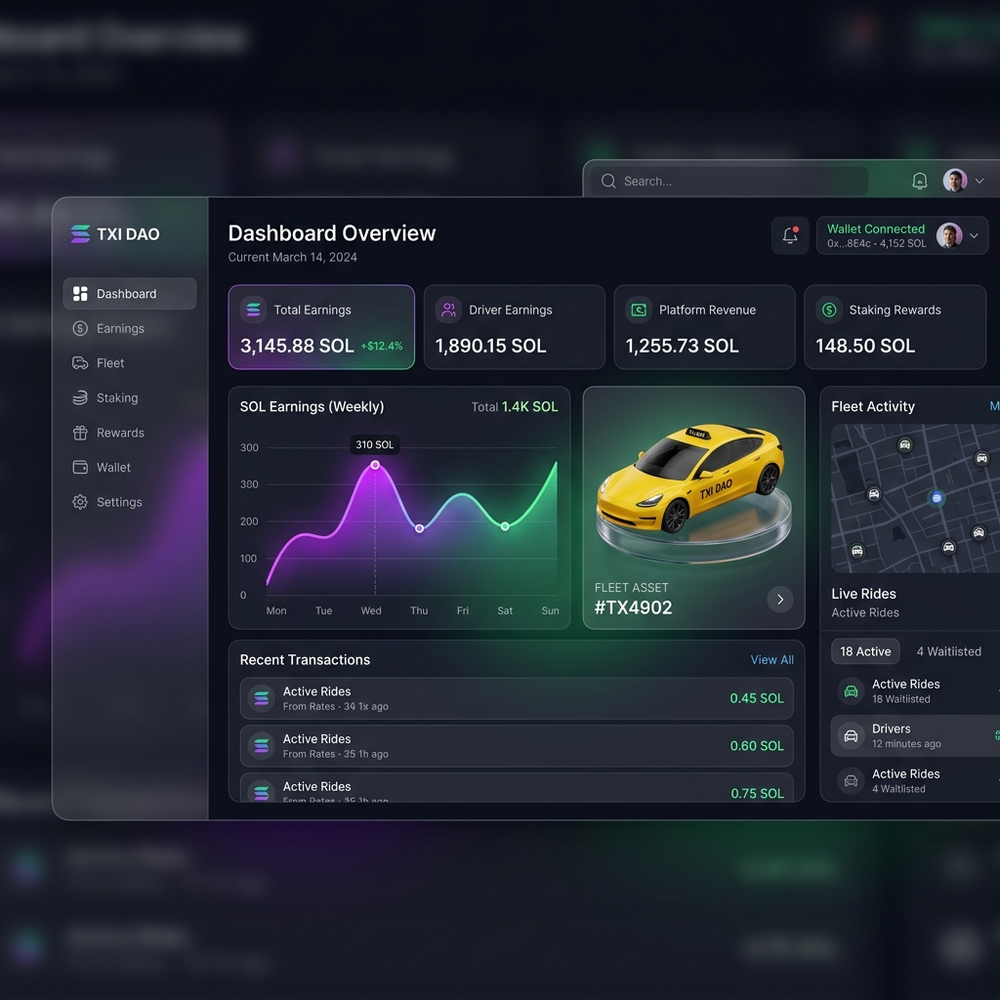

<div align="center">
  

  <h1>🚕 AXEL: RWA Taxi Tokenization on Solana</h1>

  <p><strong>A fully on-chain Real-World Asset (RWA) platform for tokenizing taxi vehicles and distributing passive income.</strong></p>

  <!-- Badges -->
  <p>
    <a href="https://solana.com"></a>
    <a href="https://nextjs.org/"></a>
    <a href="https://docs.sumsub.com/"></a>
    <a href="#"></a>
  </p>
</div>

---

## 📖 Overview

**AXEL** is a cutting-edge platform designed to democratize investments in real-world assets. Our MVP focuses on the tokenization of a single physical taxi vehicle. By purchasing tokens, investors become fractional owners of the asset and receive a proportion of the income generated from its daily operation via Yandex Pro.

**The Golden Architecture Rule:** _State is exclusively on-chain._ The frontend reads data directly from Solana RPCs, while a minimal Node.js backend handles only non-browser compatible operations: KYC webhooks and Oracle data signing.

---

## ✨ Features

- 💸 **Token-2022 Implementation.** Uses modern Solana Token Extensions (Transfer Hooks, Freeze Authority, Permanent Delegate, Metadata) to guarantee compliance without breaking composability.
- 🔒 **On-Chain Whitelist.** Peer-to-peer transfers are protected by protocol-level transfer hooks preventing non-KYC'd wallets from interacting with the asset.
- 🚖 **Live Telemetry.** Real daily revenue and mileage metrics synchronized from the Yandex Pro API straight to Solana via a signed oracle.
- 📊 **Dividend Distribution Model.** Transparent calculation of `Profit = Revenue - Expenses - Reserve`. Claiming of periods directly on-chain.
- 🚫 **No State Database.** Our React/Next.js frontend connects directly to Program Derived Addresses (PDAs) for unparalleled decentralization.

---

## 🏗 Architecture

AXEL relies on minimal centralization, shifting business logic natively to Solana Smart Contracts.

```mermaid
graph TD
    classDef frontend fill:#333,stroke:#fff,stroke-width:2px,color:#fff;
    classDef solana fill:#14F195,stroke:#9945FF,stroke-width:2px,color:#000;
    classDef backend fill:#9945FF,stroke:#14F195,stroke-width:2px,color:#fff;
    classDef api fill:#444,stroke:#aaa,stroke-width:1px,color:#fff;

    F([Next.js Frontend]):::frontend -- "Reads PDAs directly via RPC" --> S[{Solana Program}]:::solana
    F -- "Sends Transactions" --> S
    F -- "GET /telemetry/latest" --> B(Minimal Node.js Backend):::backend
    
    B -- "record_telemetry (signed)" --> S
    Y[Yandex Pro API]:::api -- "cron job data fetch" --> B
    
    K[Sumsub KYC]:::api -- "webhook validation" --> B
    B -- "add_to_whitelist" --> S
```

---

## 💻 Ecosystem & UI

Our dashboard provides a premium fintech experience tailored for Web3 investors.

<div align="center">
  
  <br>
  <em>Premium Fintech Experience for token tracking, live telemetry, and direct SOL claiming.</em>
</div>

---

## 🛠 On-Chain Entities

The core state lives in Program Derived Addresses (PDAs):

| PDA | Description |
| :--- | :--- |
| `ProjectState` | Base project configuration, tokenomics, target raise amounts |
| `InvestorRecord` | Current investment position of a participant (SOL invested / Tokens received) |
| `RevenuePeriod` | Snapshot of dividend distributions allocated for a specific time range |
| `ClaimRecord` | Audit log of individual dividend payouts |
| `WhitelistEntry` | Encrypted representation of an investor's KYC status |
| `TelemetryRecord` | Verified, oracle-signed daily performance data (e.g. `187km, 12400₸`) |

### Token Extensions (Token-2022)

- **Transfer Hook:** Real-time checking both `from` and `to` wallets for `WhitelistEntry` before allowing tokens to move.
- **Default Account State (Frozen):** Tokens are born frozen securely until KYC unlocking.
- **Permanent Delegate:** Enables regulatory clawbacks and refunds when hardcaps/softcaps are breached.
- **Transfer Fee:** 1% secondary market fee auto-routed to a reserve fund.
- **Metadata Pointer:** Immutable VIN, License, and Asset appraisal stats fixed into the mint at creation.

---

## 🔒 Security

* **True Decentralized State**: Unlike traditional platforms, we have **no traditional database**.
* **KYC Whitelisting**: Powered by Sumsub with webhook ingestion on isolated backend layer.
* **Oracle Keys**: Oracle signing pairs isolated in Secret Managers, away from public vectors.
* **Multisig Protection**: Upgrade authorities and fee harvesting protected by multi-signature protocols.

---

## 🤝 Contributing

We welcome contributions from the community. Please read our `CONTRIBUTING.md` file to see how you can help optimize our Smart Contracts or Next.js Frontend.

<div align="center">
  <b>Built for the future of RWA on Solana.</b><br>
  <i>"Make real world assets liquid, transparent, and accessible."</i>
</div>
